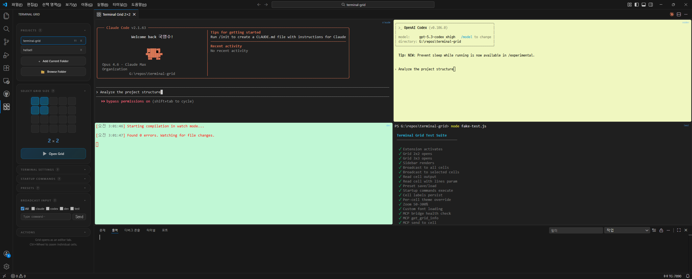

# Terminal Grid

[English](./README.md) | [한국어](./docs/README.ko.md) | [中文](./docs/README.zh-CN.md) | [日本語](./docs/README.ja.md) | [Português (Brasil)](./docs/README.pt-BR.md) | [Español](./docs/README.es.md) | [Français](./docs/README.fr.md) | [Deutsch](./docs/README.de.md)

<p align="center">
  
</p>

> Multiple terminals in a single editor tab — powered by xterm.js + node-pty



## Features

- **Grid Layout** — Open up to 4x5 (20) terminals arranged in a customizable grid
- **Sidebar Control Panel** — Manage grid size, presets, broadcast, zoom, fonts, and colors
- **Broadcast Input** — Send commands to all terminals or selected cells at once
- **Per-Cell Customization** — Individual background color, foreground color, and font per cell
- **Presets** — Save and load grid configurations with startup commands, labels, and styles
- **Startup Commands** — Auto-run commands when terminals spawn
- **Cell Labels** — Name each terminal cell for easy identification
- **Context Menu** — Right-click to paste, clear, restart, kill, or rename cells
- **MCP Server** — Built-in HTTP bridge for LLM orchestration (Claude Code, etc.)
- **Agent API** — Programmatic control via VS Code commands (`sendToCell`, `readCell`, `getGridInfo`)
- **Remote-SSH Compatible** — Works with VS Code Remote-SSH out of the box
- **Collapsible Sections** — Sidebar sections collapse to save space, state persisted

## Quick Start

1. Install the extension
2. `Ctrl+Shift+P` → **Terminal Grid: Open Grid**
3. A terminal grid appears in the editor area

## Commands

| Command | Description |
|---------|-------------|
| `Terminal Grid: Open Grid` | Open grid with default size (settings) |
| `Terminal Grid: Open 2x2` | Open a 2x2 grid |
| `Terminal Grid: Open 2x3` | Open a 2x3 grid |
| `Terminal Grid: Open 3x3` | Open a 3x3 grid |
| `Terminal Grid: Open Custom Grid` | Open grid with custom dimensions |
| `Terminal Grid: Copy MCP Config` | Copy MCP server configuration to clipboard |

## Settings

| Setting | Default | Description |
|---------|---------|-------------|
| `terminalGrid.defaultRows` | `2` | Default number of rows (1–4) |
| `terminalGrid.defaultCols` | `3` | Default number of columns (1–5) |
| `terminalGrid.zoomPercent` | `100` | Global terminal font zoom (50–300%) |
| `terminalGrid.fontFamily` | `""` | Font family override (empty = IDE theme) |
| `terminalGrid.backgroundColor` | `""` | Background color override (empty = IDE theme) |
| `terminalGrid.foregroundColor` | `""` | Foreground color override (empty = IDE theme) |
| `terminalGrid.apiPort` | `7890` | MCP HTTP bridge port (0 = disabled) |

## Sidebar Panel

The sidebar provides a full control panel:

- **Grid Controls** — Set rows/columns and open grid
- **Presets** — Save/load/delete grid configurations with per-project auto-load
- **Startup Commands** — Define commands to auto-run in each cell on grid creation
- **Cell Labels** — Assign aliases to terminal cells
- **Broadcast Input** — Send commands to all or selected cells
- **Terminal Settings** — Zoom, font family, colors with per-cell override tabs
- **Custom Fonts** — Load .ttf/.otf/.woff/.woff2 font files

## MCP Integration

Terminal Grid includes a built-in MCP (Model Context Protocol) server for LLM orchestration.

### Setup

1. `Ctrl+Shift+P` → **Terminal Grid: Copy MCP Config**
2. Paste into your MCP client settings (e.g., `~/.claude/settings.json`)

### MCP Tools

| Tool | Description |
|------|-------------|
| `get_grid_info` | Get grid dimensions, cell count, and labels |
| `send_to_cell` | Send text to a specific cell (append `\r` to execute) |
| `read_cell` | Read terminal output from a cell |
| `broadcast` | Send text to all cells at once |

### Example

```json
{
  "mcpServers": {
    "terminal-grid": {
      "command": "node",
      "args": ["/path/to/extension/mcp-server.js"],
      "env": { "TERMINAL_GRID_PORT": "7890" }
    }
  }
}
```

## Agent API

Extensions can programmatically control Terminal Grid via VS Code commands:

```typescript
// Get grid info
const info = await vscode.commands.executeCommand('terminalGrid.getGridInfo');
// { rows: 2, cols: 3, cellCount: 6, cellLabels: ['1','2',...] }

// Send command to cell 0
await vscode.commands.executeCommand('terminalGrid.sendToCell', 0, 'echo hello\r');

// Read output from cell 0 (last 10 lines)
const output = await vscode.commands.executeCommand('terminalGrid.readCell', 0, 10);
```

## Requirements

- VS Code 1.80.0+
- node-pty (auto-prompted for installation on first use)

## License

[MIT](LICENSE)
